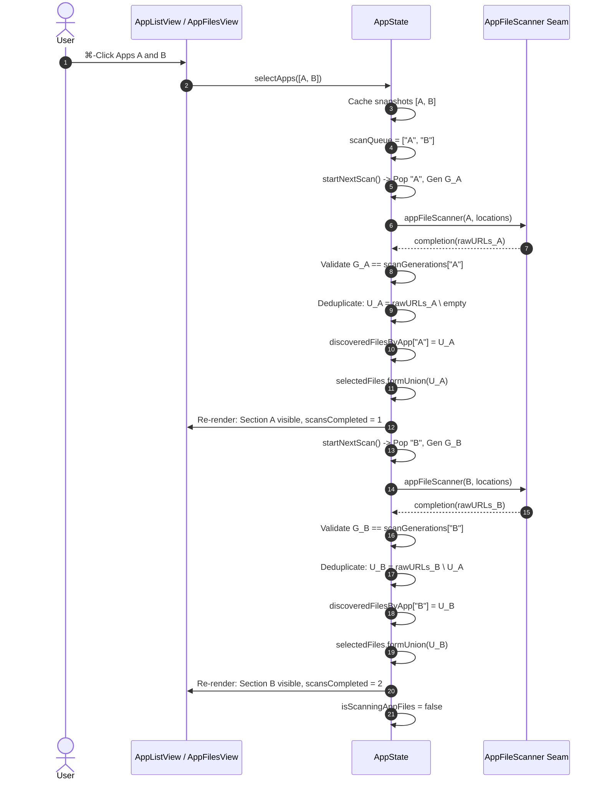

# Architectural Decision Record (ADR): Multi-Select App Uninstaller

- **Status**: Proposed
- **Date**: 2026-09-21
- **Author**: Software Architect, Maestri Engineering Team
- **Target Repository**: PureMac (`pramjana/PureMac`)
- **Document Path**: `docs/adr-proposal.md`

---

## 1. Context & Feature Statement

### 1.1 Background & Existing Single-App Paradigm
PureMac's App Uninstaller currently enforces a strictly single-selection paradigm:
- The left pane (`PureMac/Views/Apps/AppListView.swift`) hosts a SwiftUI `Table` bound to `@State private var selection: InstalledApp.ID?`.
- Selecting an application triggers `AppState.scanForAppFiles(_:)`, which purges all existing uninstaller file lists (`discoveredFiles = []`, `selectedFiles = []`), assigns a new generation UUID, and initiates an asynchronous scan via the injected `AppFileScanner` seam (`AppPathFinder`).
- The right pane (`PureMac/Views/Apps/AppFilesView.swift`) accepts a single `let app: InstalledApp` instance and renders a flat list of discovered files categorized into CleanMyMac-style buckets (`LeftoverGroup`: Application, Caches, Application Support, Preferences, Logs, Containers, Launch Agents, Other Files).

### 1.2 UX Friction & Batch Deletion Bottlenecks
Under the current single-app implementation, batch-cleaning or pruning multiple applications introduces severe operational friction:
1. **Repetitive Work Cycle**: Uninstalling $N$ applications requires repeating the full cycle:
   $$\text{Select App } k \longrightarrow \text{Wait for Scan} \longrightarrow \text{Review Leftovers} \longrightarrow \text{Initiate Trash} \longrightarrow \text{Confirm Dialog} \longrightarrow \text{System Deletion}$$
   exactly $N$ times.
2. **Context Annihilation**: Selecting a different application while reviewing an existing scan immediately discards all previously scanned files, sizes, and user-configured checkmark selections.
3. **Absence of Batch Operations**: The toolbar uninstall button (`Uninstall (N files)`) and the primary action bar button can only operate on the single actively selected application.

### 1.3 Latent Defects in Existing Architecture
Inspection of `PureMac/Views/Apps/AppFilesView.swift` revealed a critical selection-obliteration bug in single-file deletion:
```swift
// PureMac/Views/Apps/AppFilesView.swift:402-405
private func removeSingleFile(_ url: URL) {
    appState.selectedFiles = [url]
    appState.removeSelectedFiles()
}
```
In a multi-selection environment, clicking the trash can icon on a single row (`FileRow`) overwrites `selectedFiles` with `[url]`, instantly wiping out every other selected file across all other apps without user consent.

### 1.4 Business & Functional Objectives
This feature promotes PureMac's uninstaller to a **first-class batch uninstaller**:
1. **Multi-Selection UI**: Support standard macOS multi-selection paradigms (⌘-click, ⇧-click, keyboard navigation) in `AppListView`.
2. **Unified Multi-App File Hierarchy**: Display all selected apps in `AppFilesView` organized into distinct per-app collapsible sections sorted alphabetically, each retaining its own leftover groups.
3. **Progressive Feedback**: Scans execute sequentially in the background; each app section materializes in the view immediately as its scan finishes, accompanied by a dynamic progress ticker (`Scanning N of M apps...`).
4. **Deterministic Deduplication**: Shared files (e.g. shared vendor caches, group containers) discovered by multiple apps are attributed strictly to the first-scanned application ("first-scanned wins"). The file appears exactly once in the tree and is counted once in size calculations.
5. **Atomic Deselection & Reselection**: Deselecting an app immediately removes its section and file selections from the uninstall batch; re-selecting triggers a fresh scan.
6. **Unified Batch Removal**: A single global confirmation action deletes all checked leftovers across all selected applications in one atomic flow, while preserving the existing security boundaries (Full Disk Access checks, administrator privilege escalation, and high-risk dotpath guards).

---

## 2. Root-Cause & Domain Analysis

### 2.1 Functional Programming (FP) Paradigm & Identity Modeling
In `PureMac/Logic/Scanning/AppInfoFetcher.swift`, `InstalledApp` is modeled as:
```swift
struct InstalledApp: Identifiable, Hashable {
    let id: UUID
    let appName: String
    let bundleIdentifier: String
    let path: URL
    let icon: NSImage
    let size: Int64
}
```
#### Architectural Hazard: Ephemeral vs Canonical Identity
- Every invocation of `AppState.loadInstalledApps()` calls `AppInfoFetcher.shared.fetchInstalledApps()`, which instantiates **fresh random UUIDs** for every application.
- If domain state in `AppState` (such as scan caches, queued tasks, or selection sets) were keyed on `InstalledApp.id` (`UUID`), any application refresh (such as clicking the toolbar Refresh button or an automated reload after trashing) would silently sever all associations, orphaning in-flight scans and purging active selections.
- **Domain Invariant**: The domain identity of an installed application is its **`bundleIdentifier: String`**. All long-lived state dictionaries, scan queues, and generation tokens in `AppState` must be keyed strictly by `bundleIdentifier`.
- Ephemeral `InstalledApp.id` (`UUID`) is restricted to view-layer SwiftUI `Table` selection binding and mapped deterministically to/from `bundleIdentifier`.

### 2.2 Single Source of Truth & Pure Derived Computations
To avoid synchronization bugs between a flat file array and per-app file dictionaries, state is modeled using functional single-source-of-truth principles:
- **Source of Truth**: `discoveredFilesByApp: [String: [URL]]` maps `bundleIdentifier` $\to$ sorted, deduplicated `[URL]`.
- **Derived Value**: `discoveredFiles: [URL]` is a pure computed property:
  $$\text{discoveredFiles} = \operatorname{sort}\left(\bigcup_{b \in \text{selectedAppBundleIDs}} \text{discoveredFilesByApp}[b]\right)$$
  Because `discoveredFilesByApp` is marked `@Published` on `@MainActor AppState`, any mutation triggers `objectWillChange`, naturally causing SwiftUI to re-evaluate computed dependencies (including the toolbar counter, size-cache tasks, and location counters). Dual storage is strictly prohibited.
- **Selection State**: `selectedFiles: Set<URL>` represents the active set of files confirmed for trashing. When an app is dropped, its files are subtracted via pure set operations:
  $$\text{selectedFiles} \leftarrow \text{selectedFiles} \setminus \text{discoveredFilesByApp}[\text{droppedBundleID}]$$

### 2.3 Sequential Progressive Scanning Pipeline
- **I/O Contention Hazards**: File system inspection across deep directory trees (`/Applications`, `/Library/Application Support`, `~/Library/Caches`, `/private/var/db/receipts`) is heavily I/O-bound. Parallelizing multiple scans creates thread starvation, saturates APFS metadata caches, and risks thermal throttling or beachballing.
- **Progressive Delivery**: Sequential scanning processes apps one by one in lexicographical name order. As scan $k$ completes, the UI receives immediate state updates, eliminating long modal blocking states.

### 2.4 Set-Theoretic Deduplication Engine ("First-Scanned Wins")
When multiple apps share files (e.g. `~/Library/Caches/com.vendor.shared` or `/Library/LaunchDaemons/com.vendor.helper.plist`):
Let the selected apps ordered by name be $\langle A_1, A_2, \dots, A_n \rangle$.
Let the raw URL set discovered by the scanner for application $A_k$ be $R_k \subset \text{URL}$.
The attributed file set $U_k$ for $A_k$ is computed purely as:
$$U_k = R_k \setminus \left( \bigcup_{j=1}^{k-1} U_j \right)$$
#### Formal Invariants:
1. **Disjoint Partitioning**: $\forall i \neq j, \quad U_i \cap U_j = \emptyset$.
2. **Union Preservation**: $\bigcup_{k=1}^n U_k = \bigcup_{k=1}^n R_k$.
3. **Deterministic Attribution**: The ownership of a shared file is strictly determined by lexicographical sort order $A_1 \prec A_2 \prec \dots \prec A_n$.

```
Application Scan Pipeline (Sequential & Progressive):

  [ App Queue: A -> B -> C ]
          │
          ▼
   Scan App A ───► Raw Results R_A
          │               │
          │               ▼
          │       Attributed U_A = R_A
          │       (Render Section A immediately)
          ▼
   Scan App B ───► Raw Results R_B
          │               │
          │               ▼
          │       Attributed U_B = R_B \ U_A
          │       (Render Section B immediately)
          ▼
   Scan App C ───► Raw Results R_C
                          │
                          ▼
                  Attributed U_C = R_C \ (U_A ∪ U_B)
                  (Render Section C immediately)
```

### 2.5 Asynchronous Lifecycle, Cancellation, & Generation Tokens
Because `AppFileScanner` executes asynchronously:
```swift
appFileScanner(app, locations) { urls in ... }
```
A user may rapidly modify selection state:
- App $A$ is selected $\to$ scan $A_1$ starts with generation $G_1$.
- App $A$ is deselected before $A_1$ completes.
- App $A$ is re-selected $\to$ scan $A_2$ starts with generation $G_2$.
- Async callback $A_1$ arrives late.

#### Stale Token Mitigation:
`AppState` maintains `scanGenerations: [String: UUID]`.
1. Starting scan for bundle $b$: assign $G = \text{UUID}()$; set `scanGenerations[b] = G`.
2. Dropping bundle $b$: delete `scanGenerations[b]` and remove $b$ from `scanQueue`.
3. Callback entry guard:
   $$\text{Accept result iff } \left( b \in \text{selectedAppBundleIDs} \land \text{scanGenerations}[b] == G \right)$$
   Any stale completion failing this invariant is discarded with zero side-effects.

---

## 3. Evaluated Architectural Alternatives & Trade-Off Matrix

| Dimension | Alternative 1: Fully Parallel Scans via `TaskGroup` | Alternative 2: Dedicated "Shared Files" UI Section | Alternative 3: UUID-Keyed State Storage | Alternative 4 (Proposed): Sequential Progressive + BundleID Indexing |
|---|---|---|---|---|
| **I/O Contention & Disk Thrashing** | **High**: Multiple APFS traversals contend for disk heads / metadata caches. | **Low / Medium**: Scans could be sequential or parallel. | Irrelevant to I/O. | **Optimal**: Strictly sequential I/O guarantees predictable throughput without contention. |
| **Progressive User Feedback** | **Poor**: User waits until all tasks resolve or UI updates unpredictably. | **Moderate**: UI waits for clustering pass across all results. | N/A | **Optimal**: Sections materialize sequentially as each app finishes; UI remains fluid. |
| **Attribution Determinism** | **Non-Deterministic**: Shared file owner depends on async race condition. | **High**: Dedicated section explicitly isolates shared items. | N/A | **Deterministic**: Alphabetical scan order enforces reproducible "first-scanned wins" ownership. |
| **UI Complexity & HIG Alignment** | **Low**: Standard lists. | **High**: Requires novel section types, separate select-all logic, and complex deletion semantics. | N/A | **Optimal**: Standard per-app sections with reusable `DisclosureGroup` and `FileRow` components. |
| **State Resilience to Table Refresh** | N/A | N/A | **Severe Failure**: New UUIDs on refresh invalidate selections and orphan scans. | **Optimal**: Bundle ID is invariant across reloads; selection cleanly restored. |
| **Implementation Complexity** | Medium (Complex cancellation in TaskGroups). | Very High (Custom bucket management and orphan checks). | Low (Naïve approach). | **Balanced**: Clean FP state machine, robust seams, minimal view disruption. |

### Architectural Decision
**Adopt Alternative 4**:
- Key state by `bundleIdentifier: String`.
- Execute scans sequentially in name-sorted order.
- Deduplicate on completion against already-discovered URLs.
- Provide progressive per-app section rendering.

---

## 4. Specification & Implementation Plan

### 4.1 Domain Models & State Architecture (`AppState.swift`)

#### 4.1.1 State Properties
Add the following properties to `AppState` (marked `@MainActor`):
```swift
// MARK: - Multi-Select App Uninstaller State

/// Source of truth for selected apps, keyed by bundle identifier. Stable across list reloads.
@Published var selectedAppBundleIDs: Set<String> = []

/// In-memory cache of app metadata (icon, name, size, path) for section headers and Finder hand-offs.
private(set) var selectedAppSnapshots: [String: InstalledApp] = [:]

/// Discovered leftover files partitioned by app bundle identifier.
@Published var discoveredFilesByApp: [String: [URL]] = [:]

/// Computed sorted union of all discovered leftover files across all currently selected apps.
var discoveredFiles: [URL] {
    let allURLs = discoveredFilesByApp.values.flatMap { $0 }
    return Array(Set(allURLs)).sorted { $0.path < $1.path }
}

/// Progress indicators for multi-app scanning ("Scanning N of M apps...").
@Published var scansCompleted: Int = 0
@Published var scansTotal: Int = 0

/// App names associated with the most recent permission (FDA) failure, frozen at finishRemoval.
@Published var lastFailedRemovalAppNames: [String] = []

/// Sequential scan execution queue of bundle identifiers.
private var scanQueue: [String] = []

/// Per-app generation tokens to detect and drop stale asynchronous scan completions.
private var scanGenerations: [String: UUID] = [:]

/// Bundle ID of the app currently undergoing active scanning (nil if idle).
@Published private(set) var currentlyScanningBundleID: String?
```

#### 4.1.2 Primary Method Contracts

```swift
/// Set the multi-selection. Diffs incoming apps against current selection.
/// Dropped apps immediately lose files, selection, snapshots, and pending scans.
/// Newly added apps are sorted by name and appended to the sequential scan queue.
func selectApps(_ apps: [InstalledApp])

/// Force-rescan a single app in-place without disturbing other apps' discovered files.
/// Used by external Finder hand-offs and future row-level rescan triggers.
func scanForAppFiles(_ app: InstalledApp)

/// Drops an app by bundle identifier: purges files, deselects, removes snapshots, and invalidates tokens.
private func dropApp(_ bundleID: String)

/// Advances the sequential scan queue. Invokes the injected appFileScanner.
private func startNextScan()

/// Handles completion of an app scan: validates generation token, deduplicates against already-discovered URLs,
/// auto-selects new files, updates progress, and triggers startNextScan().
private func handleScanCompletion(bundleID: String, generation: UUID, rawURLs: Set<URL>)

/// Applies deleted URLs across all app dictionaries in discoveredFilesByApp and subtracts from selectedFiles.
private func applyRemovedAppFiles(_ urls: [URL])

/// Freezes failed URLs and owning app names for FDA retry, logs failures, and prunes uninstalled apps.
private func finishRemoval(
    removedAny: Bool,
    needsFullDiskAccess: Bool,
    attemptedAdmin: Bool,
    failed: [URL],
    adminError: String?
)

/// Checks disk existence for all selected apps and installed apps; prunes missing bundles via dropApp.
private func pruneMissingInstalledApps()
```

#### 4.1.3 Algorithmic Pseudo-Code

##### Selection Diffing & Queue Initialization (`selectApps`)
```swift
func selectApps(_ apps: [InstalledApp]) {
    let incomingIDs = Set(apps.map(\.bundleIdentifier))
    guard incomingIDs != selectedAppBundleIDs else { return }

    let droppedIDs = selectedAppBundleIDs.subtracting(incomingIDs)
    let addedApps = apps.filter { !selectedAppBundleIDs.contains($0.bundleIdentifier) }

    // 1. Process dropped applications
    for droppedID in droppedIDs {
        dropApp(droppedID)
    }

    // 2. Process added applications
    guard !addedApps.isEmpty else {
        selectedApp = apps.first // Maintain compatibility
        return
    }

    // Cache snapshots
    for app in addedApps {
        selectedAppSnapshots[app.bundleIdentifier] = app
        selectedAppBundleIDs.insert(app.bundleIdentifier)
    }

    // Sort added apps alphabetically by name to ensure deterministic scan order
    let sortedAdded = addedApps.sorted { $0.appName.localizedStandardCompare($1.appName) == .orderedAscending }
    let newQueueItems = sortedAdded.map(\.bundleIdentifier)

    // Reset progress tracking for the new scan batch
    scansTotal = scanQueue.count + newQueueItems.count
    scansCompleted = 0
    scanQueue.append(contentsOf: newQueueItems)

    selectedApp = apps.first

    // Start scanning if not already active
    if !isScanningAppFiles {
        startNextScan()
    }
}
```

##### Queue Progression & Scanner Execution (`startNextScan`)
```swift
private func startNextScan() {
    guard !scanQueue.isEmpty else {
        isScanningAppFiles = false
        currentlyScanningBundleID = nil
        appFileScanLocationCount = 0
        return
    }

    let bundleID = scanQueue.removeFirst()
    guard selectedAppBundleIDs.contains(bundleID),
          let app = selectedAppSnapshots[bundleID] else {
        startNextScan()
        return
    }

    isScanningAppFiles = true
    currentlyScanningBundleID = bundleID

    let locations = locationsProvider()
    appFileScanLocationCount = locations.appSearch.paths.count

    let generation = UUID()
    scanGenerations[bundleID] = generation

    appFileScanner(app, locations) { [weak self] urls in
        Task { @MainActor in
            self?.handleScanCompletion(bundleID: bundleID, generation: generation, rawURLs: urls)
        }
    }
}
```

##### Scan Completion & Deduplication (`handleScanCompletion`)
```swift
private func handleScanCompletion(bundleID: String, generation: UUID, rawURLs: Set<URL>) {
    // Stale token or deselected check
    guard selectedAppBundleIDs.contains(bundleID),
          scanGenerations[bundleID] == generation else {
        startNextScan()
        return
    }

    // Deduplicate against already discovered URLs (first-scanned wins)
    let alreadyDiscovered = Set(discoveredFilesByApp.values.flatMap { $0 })
    let attributedURLs = rawURLs.subtracting(alreadyDiscovered)
    let sortedURLs = attributedURLs.sorted { $0.path < $1.path }

    discoveredFilesByApp[bundleID] = sortedURLs
    selectedFiles.formUnion(attributedURLs)

    scansCompleted += 1
    startNextScan()
}
```

##### Single-App Force Rescan (`scanForAppFiles`)
```swift
func scanForAppFiles(_ app: InstalledApp) {
    let bundleID = app.bundleIdentifier
    selectedAppSnapshots[bundleID] = app
    selectedAppBundleIDs.insert(bundleID)
    selectedApp = app

    // Invalidate prior generation and existing file list for this app
    let generation = UUID()
    scanGenerations[bundleID] = generation
    if let existing = discoveredFilesByApp[bundleID] {
        selectedFiles.subtract(existing)
    }
    discoveredFilesByApp[bundleID] = []

    // Ensure queue does not duplicate this bundleID
    scanQueue.removeAll { $0 == bundleID }

    isScanningAppFiles = true
    currentlyScanningBundleID = bundleID
    let locations = locationsProvider()
    appFileScanLocationCount = locations.appSearch.paths.count

    appFileScanner(app, locations) { [weak self] urls in
        Task { @MainActor in
            guard let self,
                  self.selectedAppBundleIDs.contains(bundleID),
                  self.scanGenerations[bundleID] == generation else { return }

            // Deduplicate against other apps' files
            var otherDiscovered = Set<URL>()
            for (id, files) in self.discoveredFilesByApp where id != bundleID {
                otherDiscovered.formUnion(files)
            }
            let attributed = urls.subtracting(otherDiscovered)
            let sorted = attributed.sorted { $0.path < $1.path }

            self.discoveredFilesByApp[bundleID] = sorted
            self.selectedFiles.formUnion(attributed)
            self.isScanningAppFiles = false
            self.currentlyScanningBundleID = nil
            self.appFileScanLocationCount = 0
        }
    }
}
```

##### Cross-App Removal Application (`applyRemovedAppFiles`)
```swift
private func applyRemovedAppFiles(_ urls: [URL]) {
    guard !urls.isEmpty else { return }
    let urlSet = Set(urls)

    let update = {
        for bundleID in self.discoveredFilesByApp.keys {
            self.discoveredFilesByApp[bundleID]?.removeAll { urlSet.contains($0) }
        }
        self.selectedFiles.subtract(urlSet)
    }

    if NSWorkspace.shared.accessibilityDisplayShouldReduceMotion {
        update()
    } else {
        withAnimation(.spring(response: 0.35, dampingFraction: 0.8)) {
            update()
        }
    }
    Logger.shared.log("Removed \(urls.count) file\(urls.count == 1 ? "" : "s")", level: .info)
}
```

##### Pruning Uninstalled Applications (`pruneMissingInstalledApps`)
```swift
private func pruneMissingInstalledApps() {
    let fileManager = FileManager.default
    installedApps.removeAll { !fileManager.fileExists(atPath: $0.path.path) }

    for bundleID in selectedAppBundleIDs {
        if let snapshot = selectedAppSnapshots[bundleID],
           !fileManager.fileExists(atPath: snapshot.path.path) {
            dropApp(bundleID)
        }
    }
    if let current = selectedApp, !fileManager.fileExists(atPath: current.path.path) {
        selectedApp = nil
    }
}
```

---

### 4.2 Security & Permission Architecture (`PermissionCoordinator.swift`)

#### 4.2.1 Generalization of `PromptContext.uninstall`
Update `PermissionCoordinator.PromptContext` to support a collection of app names:
```swift
// PureMac/Services/PermissionCoordinator.swift:25-47
enum PromptContext {
    case general
    case cleanup(failedCount: Int)
    case uninstall(appNames: [String], failedCount: Int)

    var headline: String {
        switch self {
        case .general:
            return String(localized: "Grant Full Disk Access")
        case .cleanup(let n):
            return String(
                format: String(localized: "%lld item(s) need Full Disk Access"),
                Int64(n)
            )
        case .uninstall(let appNames, let n):
            if appNames.count == 1, let singleApp = appNames.first {
                return String(
                    format: String(localized: "Uninstalling %@: %lld file(s) need Full Disk Access"),
                    singleApp,
                    Int64(n)
                )
            } else {
                return String(
                    format: String(localized: "Uninstalling %lld apps: %lld file(s) need Full Disk Access"),
                    Int64(appNames.count),
                    Int64(n)
                )
            }
        }
    }
}
```

#### 4.2.2 Owning App Attribution in `finishRemoval`
```swift
private func finishRemoval(
    removedAny: Bool,
    needsFullDiskAccess: Bool,
    attemptedAdmin: Bool,
    failed: [URL],
    adminError: String?
) {
    isRemovingAppFiles = false
    lastFailedRemovalURLs = needsFullDiskAccess ? failed : []
    removalNeedsFullDiskAccess = needsFullDiskAccess

    if needsFullDiskAccess {
        var failedNames = Set<String>()
        let failedSet = Set(failed)
        for (bundleID, urls) in discoveredFilesByApp {
            if urls.contains(where: { failedSet.contains($0) }) {
                if let name = selectedAppSnapshots[bundleID]?.appName {
                    failedNames.insert(name)
                }
            }
        }
        lastFailedRemovalAppNames = failedNames.sorted()
    } else {
        lastFailedRemovalAppNames = []
    }

    if let message = removalFailureMessage(
        needsFullDiskAccess: needsFullDiskAccess,
        attemptedAdmin: attemptedAdmin,
        failed: failed,
        adminError: adminError
    ) {
        removalError = message
        Logger.shared.log(message, level: .error)
    }

    if removedAny {
        pruneMissingInstalledApps()
    }
}
```

---

### 4.3 Presentation Layer Architecture

#### 4.3.1 `AppListView.swift`
- **Multi-Select State**: Replace `@State private var selection: InstalledApp.ID?` with `@State private var selection: Set<InstalledApp.ID> = []`.
- **Bidirectional Synchronization**:
  ```swift
  .onChange(of: selection) { newSelection in
      let selectedApps = appState.installedApps.filter { newSelection.contains($0.id) }
      appState.selectApps(selectedApps)
  }
  .onChange(of: appState.selectedAppBundleIDs) { newBundleIDs in
      let mappedIDs = Set(appState.installedApps.filter { newBundleIDs.contains($0.bundleIdentifier) }.map(\.id))
      if selection != mappedIDs { selection = mappedIDs }
  }
  .onChange(of: appState.installedApps) { apps in
      // Refresh produces new UUIDs: remap highlight from stable bundleIDs
      let mappedIDs = Set(apps.filter { appState.selectedAppBundleIDs.contains($0.bundleIdentifier) }.map(\.id))
      if selection != mappedIDs { selection = mappedIDs }
  }
  ```
- **Detail Pane Routing**:
  ```swift
  @ViewBuilder
  private var fileDetail: some View {
      if !appState.selectedAppBundleIDs.isEmpty {
          AppFilesView()
      } else {
          EmptyStateView(
              "Select an App",
              systemImage: "cursorarrow.click.2",
              description: "Select one or more apps from the list to see related files across your system.",
              tint: Tint.purple
          )
      }
  }
  ```

#### 4.3.2 `AppFilesView.swift`
- Restructure into a scrollable vertical list of **App Sections** sorted by app name.
- **Section Component**:
  - Reusable card header with app icon, name, bundle identifier, total count, and byte size.
  - Per-app "Select All" / "Deselect All" button group operating strictly on `discoveredFilesByApp[bundleID]`.
  - Nested `LeftoverGroup` disclosure groups and `FileRow` instances scoped strictly to that app's attributed URLs.
- **Independent Disclosure State**:
  `@State private var collapsedGroups: [String: Set<LeftoverGroup>] = [:]` indexed by `bundleIdentifier`.
- **In-Flight Placeholder Card**:
  When `appState.isScanningAppFiles`, display a card at the end of the list representing `appState.currentlyScanningBundleID` with progress text: `"Scanning \(appState.scansCompleted + 1) of \(appState.scansTotal) apps..."`.
- **Row Deletion Bugfix**:
  ```swift
  private func removeSingleFile(_ url: URL) {
      appState.removeSelectedFiles(confirmedURLs: [url])
  }
  ```
- **FDA Retry Hand-off**:
  ```swift
  .onChange(of: appState.removalNeedsFullDiskAccess) { needs in
      guard needs else { return }
      let toRetry = appState.lastFailedRemovalURLs
      let names = appState.lastFailedRemovalAppNames
      let items = toRetry.map { appState.makeUninstallCleanableItem(for: $0) }
      appState.removalError = nil
      appState.removalNeedsFullDiskAccess = false
      appState.lastFailedRemovalURLs = []
      appState.lastFailedRemovalAppNames = []
      appState.requestFullDiskAccessAndRetry(
          items: items,
          context: .uninstall(appNames: names, failedCount: items.count)
      )
  }
  ```

---

### 4.4 Architectural Diagrams

#### 4.4.1 Component & Data Flow
```mermaid
flowchart TD
    subgraph UI_Layer["Presentation Layer (SwiftUI)"]
        ALV["AppListView (Table multi-select)"]
        AFV["AppFilesView (Grouped App Sections)"]
    end

    subgraph State_Layer["AppState (@MainActor)"]
        SAB["selectedAppBundleIDs: Set&lt;String&gt;"]
        DFBA["discoveredFilesByApp: [String: [URL]]"]
        SF["selectedFiles: Set&lt;URL&gt;"]
        DF["discoveredFiles: [URL] (Computed Union)"]
        SQ["scanQueue: [String]"]
        SG["scanGenerations: [String: UUID]"]
    end

    subgraph Service_Layer["Scanning & File Services"]
        AFS["AppFileScanner (AppPathFinder)"]
        AFT["AppFileTrasher (FileManager.trashItem)"]
        CE["CleaningEngine (Admin Authorization)"]
        PC["PermissionCoordinator (FDA Sheet)"]
    end

    ALV -->|selectApps| SAB
    ALV -->|selectApps| SQ
    SQ -->|startNextScan| AFS
    AFS -->|urls| DFBA
    DFBA -.->|Pure Derived| DF
    DFBA -->|Auto-select| SF
    AFV -->|Reads| DFBA
    AFV -->|removeSelectedFiles| AFT
    AFT -->|Needs Admin| CE
    AFT -->|Denied (FDA)| PC
    PC -->|Retry| AFT
```

#### 4.4.2 Sequential Scan Execution & Deduplication Sequence


---

### 4.5 Step-by-Step TDD Milestones for the Developer (M0 to M5)

#### Milestone M0: Branch & Project Regeneration
- **Branch**: `feature/multi-select-uninstall`
- **Actions**:
  1. `git checkout -b feature/multi-select-uninstall`
  2. `xcodegen generate`
  3. Validate clean baseline compilation and test pass:
     ```sh
     xcodebuild -project PureMac.xcodeproj -scheme PureMac -configuration Debug -destination 'platform=macOS' test
     ```

#### Milestone M1: Multi-Select State, Sequential Scan Queue, & Progressive Attribution
- **Target Test File**: `PureMacTests/AppStateMultiUninstallTests.swift`
- **Tests to Write (Failing first)**:
  1. `testSelectingMultipleAppsScansThemSequentially`:
     Configure stub scanner to record call sequence. Call `state.selectApps([appA, appB])`. Assert scanner invoked for `appA` only while `appB` remains queued. Invoke `appA` completion; assert scanner then invoked for `appB`. Upon `appB` completion, assert `discoveredFilesByApp` contains both, `discoveredFiles` is the sorted union, and `selectedFiles` contains all.
  2. `testAlreadyScannedAppIsNotRescannedWhenStillSelected`:
     Select `[appA]`, complete scan. Then call `selectApps([appA, appB])`. Assert scanner is invoked only for `appB`.
  3. `testReselectingDeselectedAppRescansIt`:
     Select `[appA]`, complete scan. Select `[appB]` (dropping `appA`). Re-select `[appA, appB]`. Assert fresh scan fired for `appA`.
  4. `testScanningProgressAndFlags`:
     Verify `isScanningAppFiles` remains true throughout queue execution; verify `scansCompleted` and `scansTotal` correctly track $(0, 2) \to (1, 2) \to (2, 2)$; verify reset when queue empties.
- **Implementation**:
  Add state properties to `AppState.swift`, implement `selectApps`, `dropApp`, `startNextScan`, `discoveredFiles` computed getter, and progress tracking counters.

#### Milestone M2: Deselection, Cache Invalidation, & Stale Completion Discarding
- **Tests to Write**:
  1. `testDeselectingAppRemovesItsFilesFromPaneAndSelection`:
     Select and scan `[appA, appB]`. Mutate selection to `[appA]`. Assert `discoveredFilesByApp["B"]` is nil, `discoveredFiles` lacks B's files, and `selectedFiles` has B's files subtracted.
  2. `testStaleCompletionForDeselectedAppIsDiscarded`:
     Initiate scan for `appA`. Before completion fires, call `selectApps([])` (or deselect `appA`). Fire `appA` completion block. Assert `discoveredFilesByApp` remains empty and `selectedFiles` is empty.
  3. `testForceRescanReplacesOnlyThatAppsEntry`:
     Select `[appA, appB]`, complete both. Call `state.scanForAppFiles(appA)`. Assert `appB`'s files remain intact while `appA`'s entry is replaced with the new results.
- **Implementation**:
  Add `scanGenerations` dictionary, validate generation token and active membership in completion handlers, implement single-app rescan logic.

#### Milestone M3: Cross-App Deduplication, Trashing Union, & Missing App Pruning
- **Tests to Write**:
  1. `testSharedFileAttributedToFirstScannedApp`:
     Configure stub scanner to return shared file `/Library/Caches/shared.cache` for both `appA` and `appB`. Verify that after both scans complete, the shared file exists in `discoveredFilesByApp["A"]`, does NOT exist in `discoveredFilesByApp["B"]`, and exists exactly once in `discoveredFiles`.
  2. `testRemovingFilesAcrossAppsUpdatesAllSections`:
     Populate `appA` and `appB` files. Execute removal on a URL set spanning files from both apps. Verify `applyRemovedAppFiles` purges URLs from both app entries in `discoveredFilesByApp` and subtracts them from `selectedFiles`.
  3. `testPruningUninstalledAppDropsItFromSelection`:
     Remove `appA` bundle from mock filesystem; invoke `pruneMissingInstalledApps()`. Assert `appA` is dropped from `selectedAppBundleIDs`, its files purged from `discoveredFilesByApp`, and `appB` remains untouched.
- **Implementation**:
  Implement deduplication logic in completion handler, update `applyRemovedAppFiles` to iterate `discoveredFilesByApp.keys`, rewrite `pruneMissingInstalledApps` to drop uninstalled bundle IDs.

#### Milestone M4: Multi-App Full Disk Access Retry Flow & Localization Parity
- **Tests to Write**:
  1. `testFailedRemovalSnapshotCapturesOwningAppNames`:
     Simulate a trash failure on files from `appA` and `appB` requiring FDA. Assert `lastFailedRemovalAppNames` is frozen containing `["App A", "App B"]`.
  2. `testPermissionCoordinatorHeadlineFormatting`:
     Verify that `PromptContext.uninstall(appNames: ["App A"], failedCount: 2)` renders `"Uninstalling App A: 2 file(s) need Full Disk Access"`.
     Verify that `PromptContext.uninstall(appNames: ["App A", "App B"], failedCount: 5)` renders `"Uninstalling 2 apps: 5 file(s) need Full Disk Access"`.
  3. Update `testFullDiskAccessRetryKeepsUninstallInTrashFlow` in `PureMacTests/AppStateTests.swift` to use the generalized `.uninstall(appNames:failedCount:)` context.
- **Implementation**:
  Generalize `PermissionCoordinator.PromptContext`, implement attribution in `finishRemoval`, add new localization keys to all 11 `Localizable.strings` files, verify `LocalizationFilesTests` passes.

#### Milestone M5: Presentation Views, Reduced Motion, & Documentation
- **UI & Presentation Implementation**:
  1. `PureMac/Views/Apps/AppListView.swift`: Wire `Table` multi-select binding, add `.onChange` synchronization and refresh remapping.
  2. `PureMac/Views/Apps/AppFilesView.swift`: Restructure layout into per-app sections, per-app header cards with Select All / Deselect All, independent `collapsedGroups` state, scanning progress indicator, and fix `removeSingleFile`.
  3. `README.md`: Update App Uninstaller section explaining ⌘-click and ⇧-click multi-selection.
  4. Manual verification against the 11 verification gates.

---

## 5. System Invariants, Security, & Non-Functional Requirements (NFRs)

### 5.1 Security & Sandboxing Posture
1. **High-Risk Dotpaths Protection Invariant**:
   Under no circumstances may any file belonging to `highRiskHomeDotPaths` (defined in `PureMac/Logic/Scanning/Conditions.swift`, including `~/.ssh`, `~/.aws`, `~/.gnupg`, `~/.gitconfig`, `~/.zshrc`) be trashed or passed to the cleaning engine, even if returned by heuristic scan rules. This check is enforced unconditionally in `AppState.removeSelectedFiles` before invoking `appFileTrasher`.
2. **Full Disk Access (FDA / TCC) Boundary**:
   Trashing files in protected directories (`~/Library/Containers`, `~/Library/Application Support/MobileSync`) requires Full Disk Access. Syscalls must originate from `PureMac.app` via `FileManager.default.trashItem` to ensure TCC registers PureMac in System Settings.
3. **Frozen Snapshot Invariant**:
   `lastFailedRemovalURLs` and `lastFailedRemovalAppNames` must be frozen at `finishRemoval` time. If the user clicks other apps or alters selections while the FDA sheet is displayed, the retry callback must strictly process the frozen snapshot.

### 5.2 Concurrency & Thread-Safety Guarantees
1. **`@MainActor` State Isolation**:
   `AppState` and `PermissionCoordinator` are `@MainActor` isolated. All `@Published` mutations, selection changes, and queue progressions must occur on the main actor.
2. **Background I/O Offloading**:
   All filesystem inspection (`AppFileScanner`) and trashing (`AppFileTrasher`) must execute on background threads (`Task.detached(priority: .userInitiated)` or `DispatchQueue.global(qos: .userInitiated)`).
3. **Re-entrance Guard**:
   `removeSelectedFiles` must refuse execution if `isRemovingAppFiles` is true, `removalNeedsFullDiskAccess` is true, or `PermissionCoordinator.shared.isRequesting` is true.

### 5.3 Localization Parity & Resource Integrity
PureMac enforces strict locale parity via `PureMacTests/LocalizationFilesTests.swift`. All 11 localization directories must include the new keys with exact matching format specifiers:

| Locale Directory | `"Scanning %lld of %lld apps..."` | `"Uninstalling %lld apps: %lld file(s) need Full Disk Access"` | Format Specifier Signature |
|---|---|---|---|
| `PureMac/en.lproj/Localizable.strings` | `"Scanning %lld of %lld apps..."` | `"Uninstalling %lld apps: %lld file(s) need Full Disk Access"` | `["1:lld", "2:lld"]` |
| `PureMac/ar.lproj/Localizable.strings` | Match / EN Fallback | Match / EN Fallback | `["1:lld", "2:lld"]` |
| `PureMac/es.lproj/Localizable.strings` | Match / EN Fallback | Match / EN Fallback | `["1:lld", "2:lld"]` |
| `PureMac/fr.lproj/Localizable.strings` | Match / EN Fallback | Match / EN Fallback | `["1:lld", "2:lld"]` |
| `PureMac/ja.lproj/Localizable.strings` | Match / EN Fallback | Match / EN Fallback | `["1:lld", "2:lld"]` |
| `PureMac/pl.lproj/Localizable.strings` | Match / EN Fallback | Match / EN Fallback | `["1:lld", "2:lld"]` |
| `PureMac/pt-BR.lproj/Localizable.strings`| Match / EN Fallback | Match / EN Fallback | `["1:lld", "2:lld"]` |
| `PureMac/ru.lproj/Localizable.strings` | Match / EN Fallback | Match / EN Fallback | `["1:lld", "2:lld"]` |
| `PureMac/uk.lproj/Localizable.strings` | Match / EN Fallback | Match / EN Fallback | `["1:lld", "2:lld"]` |
| `PureMac/zh-Hans.lproj/Localizable.strings`| Match / EN Fallback | Match / EN Fallback | `["1:lld", "2:lld"]` |
| `PureMac/zh-Hant.lproj/Localizable.strings`| Match / EN Fallback | Match / EN Fallback | `["1:lld", "2:lld"]` |

### 5.4 Performance, Latency, & Ergonomics
1. **Render Decoupling**: High-frequency path updates must route strictly through `ScanProgressTicker` to prevent whole-tree invalidation of SwiftUI views.
2. **Asynchronous Lazy Size Caching**: Total sizes in `AppFilesView` must be evaluated asynchronously off the main thread via `sizeCache` keyed on `URL`, avoiding synchronous `stat` syscalls during render passes.
3. **Accessibility & Reduce Motion**: All row removal sweeps and spring animations must branch on `NSWorkspace.shared.accessibilityDisplayShouldReduceMotion`.

---

## 6. Verification & Acceptance Criteria

### 6.1 Automated Test Execution Command
The developer must verify implementation using the standard repository test runner:
```sh
xcodegen generate
xcodebuild -project PureMac.xcodeproj -scheme PureMac \
  -configuration Debug -destination 'platform=macOS' \
  -derivedDataPath build-tests CODE_SIGNING_ALLOWED=NO test
```
All tests in `AppStateTests`, `AppStateMultiUninstallTests`, and `LocalizationFilesTests` must pass with zero failures.

### 6.2 Manual Verification Checklist (11 Testing Gates)
1. **Multi-Selection Interaction**: ⌘-click and ⇧-click select multiple apps in the left table; sections materialize sequentially with the "Scanning N of M apps..." ticker.
2. **Instant Deselection**: Deselecting an app instantly drops its section and subtracts its files from the pending uninstall count; re-selecting triggers a fresh scan.
3. **Shared File Deduplication**: A file shared between two apps (e.g. shared vendor cache) appears once, attributed strictly to the first-scanned application.
4. **Single File Trash Isolation**: Clicking trash on a single file row deletes only that file; selections on all other apps remain intact.
5. **Combined Action Bar**: Bottom action bar reflects the total union count and byte size across all selected apps; confirmation dialog displays the combined batch size.
6. **Multi-App FDA Failure Sheet**: Failed deletion across two apps triggers the FDA permission sheet with headline `"Uninstalling 2 apps: N file(s) need Full Disk Access"`; granting permission retries the frozen batch.
7. **Post-Uninstall Pruning**: Fully uninstalling one app prunes its table entry and drops its section; remaining selected apps remain visible and intact.
8. **Finder Services Hand-Off**: Right-click "Uninstall with PureMac" on a bundle replaces current selection; if already selected, force-rescans in place.
9. **Refresh Resilience**: Clicking Refresh re-populates installed apps with new UUIDs; table highlights and section files survive via bundle ID remapping.
10. **Reduce Motion Compliance**: Toggling Reduce Motion in System Settings collapses animations to immediate opacity fades without visual clipping.
11. **Localization Parity**: `LocalizationFilesTests` passes across all 11 languages; non-English locales render without runtime missing-key warnings.

---

## 7. Architecture Sign-Off & Handoff
This specification establishes the authoritative architectural blueprint for the Multi-Select App Uninstaller feature. All contracts, domain models, data flows, and security constraints are finalized.

**Handoff Directive**: Hand off this document (`docs/adr-proposal.md`) to the **Project Orchestrator** to dispatch implementation to the **Software Developer** following Milestones M0 through M5.
