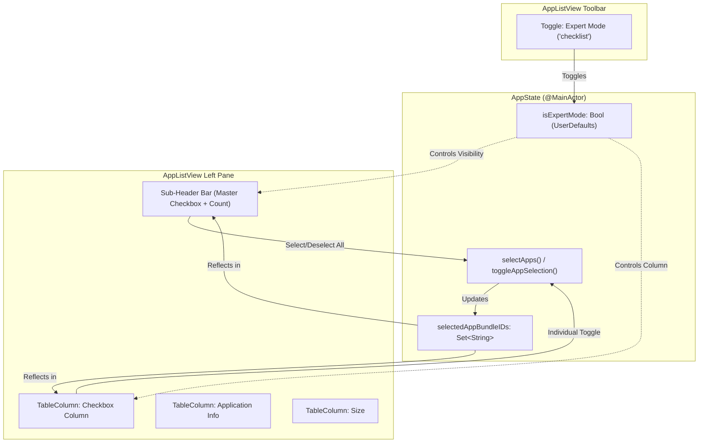
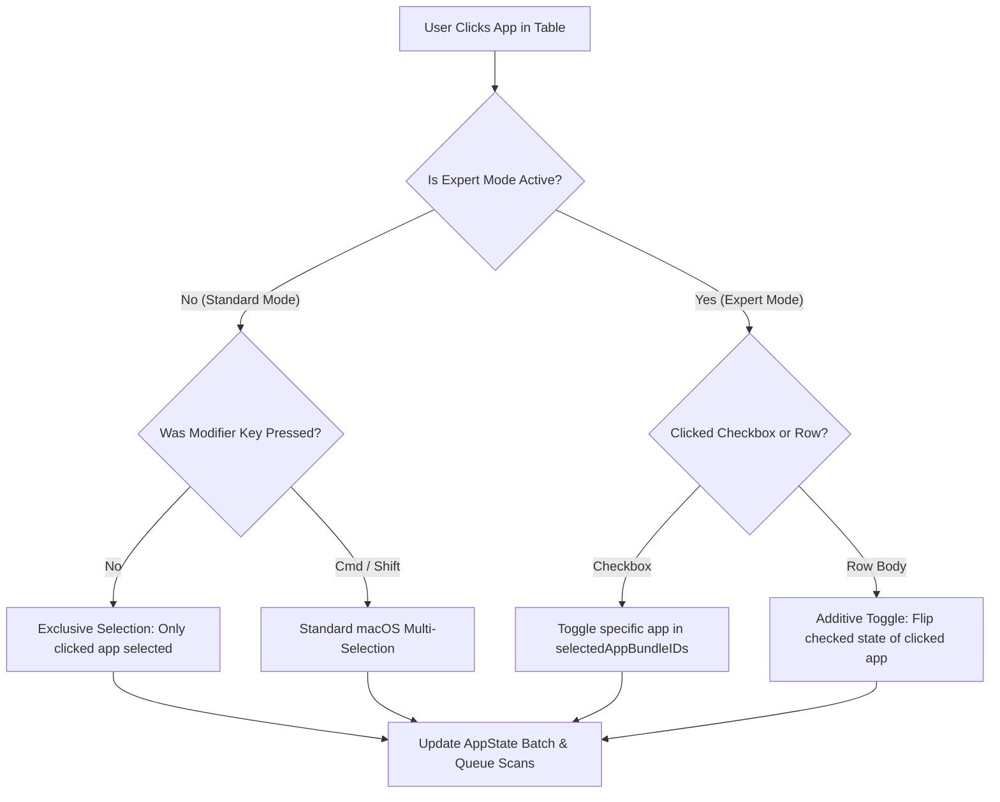

# Architectural Decision Record (ADR): Expert Mode Checkbox Multi-Selection for App Uninstaller

- **Status**: Proposed
- **Date**: 2026-09-21
- **Author**: Software Architect, Maestri Engineering Team
- **Target Release**: v3.2.0
- **Branch**: `feature/expert-mode-multi-select`
- **Target Repository**: PureMac (`pramjana/PureMac`)
- **Document Path**: `docs/adr-proposal.md`

---

## 1. Context & Feature Statement

### 1.1 Background & Existing Paradigm
PureMac v3.1.0 introduced multi-selection for the App Uninstaller, enabling users to select multiple applications simultaneously and process them in a single batch. In v3.1.0, multi-selection relies on standard macOS `NSTableView` / SwiftUI `Table` modifier key behaviors:
- **⌘-Click (`Command-Click`)**: Toggles an individual application in/out of the selection set.
- **⇧-Click (`Shift-Click`)**: Extends a contiguous range selection between the anchor row and the clicked row.
- **`AppState.selectedAppBundleIDs: Set<String>`**: Serves as the canonical, persistent source of truth, synchronizing bidirectionally with the ephemeral `Table(selection: $selection)` UUID set.

### 1.2 UX Friction & Problem Statement
While ⌘-click and ⇧-click are canonical paradigms for desktop power users, relying *exclusively* on keyboard modifiers creates significant operational friction and usability pitfalls:
1. **Accidental Selection Destruction**: If a user carefully ⌘-clicks 8 applications, and then accidentally clicks a 9th application without depressing the ⌘ key, `NSTableView` immediately discards all 8 prior selections and resets the selection strictly to the 9th row. All review progress is instantly wiped out.
2. **Discoverability Barrier**: Non-technical users, trackpad-oriented users, and users with accessibility/motor challenges frequently struggle with or are unaware of ⌘-click multi-selection in macOS tables.
3. **Physical Strain on Mobile/Laptop Form Factors**: Holding modifier keys while scrolling and clicking across long application lists on a MacBook trackpad introduces unnecessary physical strain.

### 1.3 User Goals & Business Requirements
To resolve these ergonomics issues while preserving the clean, minimalist macOS aesthetic for users who prefer standard selection:
1. **Explicit Expert Mode**: Introduce an **"Expert Mode"** toggle in the `AppListView` toolbar.
2. **Checkbox Column**: When Expert Mode is active, an explicit checkbox column materializes as the first column in the installed applications table (`AppListView`).
3. **Additive Direct Checking**: Users can directly check and uncheck applications to add or remove them from the batch uninstaller without touching modifier keys.
4. **Clean Default State**: When Expert Mode is toggled off, the checkbox column disappears, restoring the standard uncluttered table layout.
5. **Header Select All / Deselect All**: Provide a dedicated header control in Expert Mode enabling instant batch selection or clearing of all currently filtered applications.
6. **State Persistence**: The user's preference for Expert Mode must persist across application relaunches via `UserDefaults`.

---

## 2. Root-Cause & Domain Analysis

### 2.1 State Model & Persistence (`AppState.isExpertMode`)
Expert Mode is a user preference that governs view layout and interaction semantics. It must be accessible globally across `AppListView` and `SettingsView`.

#### Persistence Invariants
- **Key**: `static let expertModeKey = "settings.uninstaller.expertMode"`
- **Default Value**: `false` (Opt-in: preserves PureMac's clean standard interface out-of-the-box).
- **Reactive Publication**: Stored as an `@Published var isExpertMode: Bool` property on `@MainActor AppState` with a `didSet` observer synchronizing to `UserDefaults.standard`.
- **Bidirectional Settings Integration**: Accessible in `GeneralSettingsView` via `@AppStorage("settings.uninstaller.expertMode")` or directly via `appState.isExpertMode`.

```swift
// State Definition in AppState.swift
@Published var isExpertMode: Bool {
    didSet {
        UserDefaults.standard.set(isExpertMode, forKey: Self.expertModeKey)
    }
}
```

### 2.2 Table Interaction & SwiftUI macOS 13 Constraints
PureMac targets **macOS 13.0+**. SwiftUI's `Table` on macOS 13 wraps AppKit's `NSTableView`.

#### Column Rendering Mechanics
SwiftUI `TableColumnBuilder` supports conditional `if` blocks natively:
```swift
Table(filteredApps, selection: $selection, sortOrder: $sortOrder) {
    if appState.isExpertMode {
        TableColumn(Text(Image(systemName: "checkmark.square"))) { app in
            Toggle(isOn: binding(for: app)) {
                EmptyView()
            }
            .toggleStyle(AnimatedCheckboxStyle())
            .labelsHidden()
        }
        .width(ideal: 24, max: 32)
    }
    
    TableColumn("Application", value: \.appName) { app in ... }
    TableColumn("Size", value: \.size) { app in ... }
}
```

#### Layout Invariant: Identity Re-creation
In macOS 13, dynamically inserting or removing an `NSTableColumn` in an active `NSTableView` can occasionally result in lingering column widths or clipping artifacts.
- **Invariant**: The `Table` view must be annotated with `.id(appState.isExpertMode)` (or embedded in a conditional structure) to guarantee a pristine AppKit column layout pass whenever Expert Mode is toggled.

### 2.3 Interaction Ergonomics: Plain Row Click vs Checkbox Click
In a standard `Table(selection: $selection)`:
- Clicking a checkbox (`Toggle`) intercepts the mouse event; the toggle's binding executes, mutating `selectedAppBundleIDs`.
- Clicking the row body (e.g. app name, icon, size) triggers `NSTableView` selection logic. Without modifier keys, `NSTableView` sets `selection = [clickedRowID]`.

#### The Selection-Loss Trap
If `selection` changes to `[clickedRowID]`, a naive `.onChange(of: selection)` handler would invoke `appState.selectApps([clickedApp])`, immediately unchecking all other applications!

#### Ergonomic Design: Additive Row Toggle in Expert Mode
To eliminate this risk and provide optimal trackpad usability:
1. **In Standard Mode (`isExpertMode == false`)**:
   - Plain click on row = Exclusive single selection (`[clickedApp]`).
   - ⌘-click = Add/remove toggle.
   - ⇧-click = Contiguous range selection.
2. **In Expert Mode (`isExpertMode == true`)**:
   - **Checkbox Click**: Toggles that app in/out of `selectedAppBundleIDs`.
   - **Plain Row Click**: Behaves as an **additive toggle**. Clicking anywhere on the row toggles the application's checked state.
   - **Accidental Deselection Prevention**: A row click *never* wipes out other selected applications while in Expert Mode.
   - **Clearing Selection**: The user explicitly taps "Deselect All" in the sub-header bar or toolbar.

### 2.4 Header Select All / Deselect All
In SwiftUI `Table`, column headers (`TableColumn`) only accept `Text` / `LocalizedStringKey` labels and intercept mouse clicks strictly for sorting; they do not host interactive controls (such as clickable buttons or toggles) in `NSTableHeaderCell`.

#### Architectural Solution: Sub-Header Control Bar
When `appState.isExpertMode` is `true`, a compact, elegant control bar is rendered directly above the `Table`:
- **Master Checkbox Toggle**: Toggling selects all or deselects all currently filtered applications.
- **Selection Badge**: Displays `"%lld of %lld apps selected"` in monospaced digits.
- **Action Buttons**: Direct "Select All" and "Deselect All" buttons.

```
┌───────────────────────────────────────────────────────────┐
│ Search: [ Search apps                                   ] │
├───────────────────────────────────────────────────────────┤
│ [☑] Select All         3 of 42 apps selected  [Clear All] │ <── Sub-Header Bar
├───────┬───────────────────────────────────┬───────────────┤
│   ☑   │ Application                       │ Size          │ <── Table Header
├───────┼───────────────────────────────────┼───────────────┤
│  [✓]  │ Slack                             │ 240 MB        │
│  [✓]  │ Spotify                           │ 180 MB        │
│  [ ]  │ Docker                            │ 2.4 GB        │
│  [✓]  │ Visual Studio Code                │ 450 MB        │
└───────┴───────────────────────────────────┴───────────────┘
```

---

## 3. Evaluated Architectural Alternatives & Trade-Off Matrix

| Dimension | Alternative 1: Checkbox Only, Plain Row Click Exclusive | Alternative 2: Dual State (Inspection vs Batch Checked) | Alternative 3 (Proposed): Additive Row Toggle + Sub-Header Bar |
|---|---|---|---|
| **Accidental Deselection Risk** | **Critical**: Clicking 3px outside a checkbox wipes the entire multi-app batch. | **Low**: Checkboxes govern batch; row click changes focus. | **Zero**: Plain row click toggles checkbox; selection can only be cleared via explicit button. |
| **Trackpad Ergonomics** | **Poor**: User must precisely target 16×16px checkboxes for every row. | **Moderate**: Two distinct selection concepts on one screen. | **Optimal**: Entire row is a toggle target in Expert Mode. |
| **Cognitive Complexity** | **Moderate**: Standard table semantics. | **High**: Confusing dual-selection (which apps are highlighted vs checked). | **Low & Intuitive**: Single unified concept of selection. |
| **macOS HIG Alignment** | Follows native AppKit list view conventions. | Diverges from standard macOS table patterns. | Conforms to modern macOS checklist patterns (Reminders, CleanMyMac). |
| **Implementation Complexity** | Low | High (requires separate `inspectedApp` state in `AppState`). | Low-to-Medium (clean synchronization guard in `AppListView`). |

### Architectural Decision
**Adopt Alternative 3**:
- Provide an explicit toolbar toggle for Expert Mode.
- Render a dedicated checkbox column (`width: 24..32`) when Expert Mode is active.
- Treat plain row clicks as additive toggles while in Expert Mode to guarantee zero accidental deselection.
- Provide a dedicated sub-header bar above the table with master toggle and selection badge.

---

## 4. Specification & Implementation Plan

### 4.1 Domain Models & State Architecture (`AppState.swift`)

#### 4.1.1 State Additions
```swift
// MARK: - Expert Mode State

/// Persistent key for Expert Mode in UserDefaults.
static let expertModeKey = "settings.uninstaller.expertMode"

/// Controls whether the checkbox multi-selection column and controls are visible in AppListView.
@Published var isExpertMode: Bool {
    didSet {
        UserDefaults.standard.set(isExpertMode, forKey: Self.expertModeKey)
    }
}
```

#### 4.1.2 Initialization
In `AppState.init(...)`:
```swift
self.isExpertMode = UserDefaults.standard.bool(forKey: Self.expertModeKey)
```

#### 4.1.3 Selection Helper Methods
To maintain functional clean boundaries, provide semantic methods on `AppState`:
```swift
/// Toggles an application's inclusion in the multi-uninstall batch.
func toggleAppSelection(_ app: InstalledApp) {
    if selectedAppBundleIDs.contains(app.bundleIdentifier) {
        let remaining = selectedApps.filter { $0.bundleIdentifier != app.bundleIdentifier }
        selectApps(remaining)
    } else {
        selectApps(selectedApps + [app])
    }
}

/// Selects all applications in the provided list.
func selectAllApps(_ apps: [InstalledApp]) {
    guard !apps.isEmpty else { return }
    let union = Array(Set(selectedApps + apps))
    selectApps(union)
}

/// Deselects all applications in the provided list.
func deselectAllApps(_ apps: [InstalledApp]) {
    guard !apps.isEmpty else { return }
    let toRemoveIDs = Set(apps.map(\.bundleIdentifier))
    let remaining = selectedApps.filter { !toRemoveIDs.contains($0.bundleIdentifier) }
    selectApps(remaining)
}
```

---

### 4.2 Presentation Layer Architecture (`AppListView.swift`)

#### 4.2.1 Toolbar Item Integration
Add the Expert Mode toggle to the toolbar in `AppListView`:
```swift
// In AppListView.swift toolbar
Toggle(isOn: $appState.isExpertMode) {
    Label("Expert Mode", systemImage: appState.isExpertMode ? "checklist.checked" : "checklist")
}
.help(appState.isExpertMode ? String(localized: "Hide selection checkboxes") : String(localized: "Toggle checkboxes for batch multi-selection"))
.accessibilityLabel(String(localized: "Expert Mode"))
```

#### 4.2.2 Sub-Header Bar
Inserted above the `Table` inside `appTable`:
```swift
private var expertModeHeaderBar: some View {
    let allFilteredSelected = !filteredApps.isEmpty && filteredApps.allSatisfy { appState.selectedAppBundleIDs.contains($0.bundleIdentifier) }
    let selectedFilteredCount = filteredApps.filter { appState.selectedAppBundleIDs.contains($0.bundleIdentifier) }.count

    return HStack(spacing: 10) {
        Toggle(isOn: Binding(
            get: { allFilteredSelected },
            set: { select in
                if select {
                    appState.selectAllApps(filteredApps)
                } else {
                    appState.deselectAllApps(filteredApps)
                }
            }
        )) {
            Text(allFilteredSelected ? "Deselect All" : "Select All")
                .font(.system(size: 12, weight: .medium))
        }
        .toggleStyle(AnimatedCheckboxStyle())

        Spacer()

        Text(String(
            format: String(localized: "%lld of %lld apps selected"),
            Int64(selectedFilteredCount),
            Int64(filteredApps.count)
        ))
        .font(.system(size: 11.5))
        .foregroundStyle(.secondary)
        .monospacedDigit()
    }
    .padding(.horizontal, 14)
    .padding(.vertical, 8)
    .background(Color.primary.opacity(0.03))
    .overlay(alignment: .bottom) {
        Divider().opacity(0.5)
    }
}
```

#### 4.2.3 Table Implementation
```swift
Table(filteredApps, selection: $selection, sortOrder: $sortOrder) {
    if appState.isExpertMode {
        TableColumn(Text(Image(systemName: "checkmark.square"))) { app in
            let isChecked = appState.selectedAppBundleIDs.contains(app.bundleIdentifier)
            Toggle(isOn: Binding(
                get: { isChecked },
                set: { _ in appState.toggleAppSelection(app) }
            )) {
                EmptyView()
            }
            .toggleStyle(AnimatedCheckboxStyle())
            .labelsHidden()
        }
        .width(ideal: 24, max: 32)
    }

    TableColumn("Application", value: \.appName) { app in
        HStack(spacing: 8) {
            HoverScaleIcon(icon: app.icon)
            Text(app.appName)
        }
    }
    .width(min: 150)

    TableColumn("Size", value: \.size) { app in
        Text(app.formattedSize)
            .monospacedDigit()
            .foregroundStyle(.secondary)
    }
    .width(ideal: 70)
}
.id(appState.isExpertMode)
.onChange(of: selection) { newSelection in
    if appState.isExpertMode {
        // In Expert Mode, row selection changes are additive to prevent accidental batch loss
        let currentIDs = Set(appState.installedApps.filter { appState.selectedAppBundleIDs.contains($0.bundleIdentifier) }.map(\.id))
        let diff = newSelection.symmetricDifference(currentIDs)
        if diff.count == 1, let toggledID = diff.first,
           let app = appState.installedApps.first(where: { $0.id == toggledID }) {
            appState.toggleAppSelection(app)
        }
    } else {
        // Standard mode: selection is authoritative
        let selectedApps = appState.installedApps.filter { newSelection.contains($0.id) }
        appState.selectApps(selectedApps)
    }
}
```

---

### 4.3 General Settings Integration (`SettingsView.swift`)
Add an Expert Mode toggle to `GeneralSettingsView` under the "App Scanning" section:
```swift
Section("App Scanning") {
    Toggle("Expert Mode (checkbox multi-selection)", isOn: $appState.isExpertMode)
    
    Picker("Search sensitivity", selection: $sensitivity) { ... }
}
```

---

### 4.4 Localization Parity Specification (11 Locales)

To satisfy `PureMacTests/LocalizationFilesTests.swift`, the following 3 new keys must be added to **all 11** `Localizable.strings` files:

1. `"Expert Mode"`
2. `"Toggle checkboxes for batch multi-selection"`
3. `"%lld of %lld apps selected"` (Format signature: `["1:lld", "2:lld"]`)

*(Note: `"Select All"` and `"Deselect All"` already exist across all 11 locales).*

| Locale | File Path | `"Expert Mode"` | `"Toggle checkboxes for batch multi-selection"` | `"%lld of %lld apps selected"` |
|---|---|---|---|---|
| **English** | `en.lproj/Localizable.strings` | `"Expert Mode"` | `"Toggle checkboxes for batch multi-selection"` | `"%lld of %lld apps selected"` |
| **Arabic** | `ar.lproj/Localizable.strings` | `"وضع الخبراء"` / Fallback | `"تبديل خانات الاختيار للتحديد المتعدد"` / Fallback | `"%lld من %lld تطبيق محدد"` / Fallback |
| **Spanish** | `es.lproj/Localizable.strings` | `"Modo experto"` / Fallback | `"Activar casillas para selección múltiple"` / Fallback | `"%lld de %lld apps seleccionadas"` / Fallback |
| **French** | `fr.lproj/Localizable.strings` | `"Mode expert"` / Fallback | `"Afficher les cases à cocher pour sélection multiple"` / Fallback | `"%lld sur %lld apps sélectionnées"` / Fallback |
| **Japanese** | `ja.lproj/Localizable.strings` | `"エキスパートモード"` / Fallback | `"複数選択用チェックボックスを切り替え"` / Fallback | `"%lld / %lld 個のアプリを選択中"` / Fallback |
| **Polish** | `pl.lproj/Localizable.strings` | `"Tryb eksperta"` / Fallback | `"Przełącz pola wyboru dla zaznaczania wielu"` / Fallback | `"%lld z %lld aplikacji zaznaczonych"` / Fallback |
| **Portuguese (BR)** | `pt-BR.lproj/Localizable.strings` | `"Modo especialista"` / Fallback | `"Alternar caixas para seleção múltipla"` / Fallback | `"%lld de %lld apps selecionados"` / Fallback |
| **Russian** | `ru.lproj/Localizable.strings` | `"Режим эксперта"` / Fallback | `"Показать флажки для множественного выбора"` / Fallback | `"Выбрано %lld из %lld приложений"` / Fallback |
| **Ukrainian** | `uk.lproj/Localizable.strings` | `"Режим експерта"` / Fallback | `"Показати прапорці для множинного вибору"` / Fallback | `"Вибрано %lld з %lld програм"` / Fallback |
| **Chinese (Simp.)** | `zh-Hans.lproj/Localizable.strings` | `"专家模式"` / Fallback | `"切换批量多选复选框"` / Fallback | `"已选择 %lld / %lld 个应用"` / Fallback |
| **Chinese (Trad.)** | `zh-Hant.lproj/Localizable.strings` | `"專家模式"` / Fallback | `"切換批量多選核取方塊"` / Fallback | `"已選取 %lld / %lld 個應用程式"` / Fallback |

---

### 4.5 Architectural Diagrams

#### 4.5.1 Component & State Flow


#### 4.5.2 Selection Interaction Flowchart


---

### 4.6 Step-by-Step TDD Milestones for Developer (M0 to M5)

#### Milestone M0: Branch & Project Verification
- **Branch**: `feature/expert-mode-multi-select`
- **Actions**:
  1. `git checkout -b feature/expert-mode-multi-select`
  2. `xcodegen generate`
  3. Verify baseline test suite passes:
     ```sh
     xcodebuild -project PureMac.xcodeproj -scheme PureMac -configuration Debug -destination 'platform=macOS' test
     ```

#### Milestone M1: State Model & Persistence (`AppState.isExpertMode`)
- **Target Test File**: `PureMacTests/AppStateMultiUninstallTests.swift` (or new `PureMacTests/AppStateExpertModeTests.swift`)
- **Tests to Write (Failing first)**:
  1. `testExpertModeDefaultsToFalse`:
     Instantiate fresh `AppState`. Verify `isExpertMode == false`.
  2. `testTogglingExpertModePersistsToUserDefaults`:
     Set `state.isExpertMode = true`. Verify `UserDefaults.standard.bool(forKey: AppState.expertModeKey) == true`. Set to `false`, verify persistence.
  3. `testExpertModeInitializesFromStoredUserDefaults`:
     Seed `UserDefaults.standard.set(true, forKey: AppState.expertModeKey)`. Instantiate `AppState`. Verify `state.isExpertMode == true`. Clean up test defaults.
- **Implementation**:
  Add `static let expertModeKey`, `@Published var isExpertMode: Bool`, and initialize in `AppState.init`.

#### Milestone M2: Selection Helper Ergonomics Logic
- **Tests to Write**:
  1. `testToggleAppSelectionAddsAndRemovesApp`:
     Start with `appA` selected. Call `toggleAppSelection(appB)` $\to$ both `appA` and `appB` selected. Call `toggleAppSelection(appA)` $\to$ only `appB` selected.
  2. `testSelectAllAppsAddsEntireListToBatch`:
     Call `selectAllApps([appA, appB, appC])` $\to$ all three present in `selectedAppBundleIDs`.
  3. `testDeselectAllAppsRemovesTargetListPreservingOthers`:
     Start with `[appA, appB, appC]` selected. Call `deselectAllApps([appA, appB])` $\to$ only `appC` remains selected.
- **Implementation**:
  Implement `toggleAppSelection`, `selectAllApps`, and `deselectAllApps` on `AppState`.

#### Milestone M3: Localization Parity (All 11 Locales)
- **Tests to Run**:
  `LocalizationFilesTests.swift` (`testAllLocalizableStringsFilesHaveEnglishKeyParity`, `testAllLocalizedValuesPreserveEnglishFormatSpecifiers`).
- **Implementation**:
  Add keys:
  - `"Expert Mode"`
  - `"Toggle checkboxes for batch multi-selection"`
  - `"%lld of %lld apps selected"`
  to all 11 `Localizable.strings` files (`ar`, `en`, `es`, `fr`, `ja`, `pl`, `pt-BR`, `ru`, `uk`, `zh-Hans`, `zh-Hant`). Verify tests pass.

#### Milestone M4: View Presentation & Table Interaction (`AppListView.swift`)
- **Actions**:
  1. Add toolbar item: `Toggle` for `appState.isExpertMode` with `"checklist"` icon, tooltip, and accessibility label.
  2. Add `expertModeHeaderBar` with master toggle and `"%lld of %lld apps selected"` badge.
  3. Add conditional `TableColumn` with `AnimatedCheckboxStyle` and `.id(appState.isExpertMode)`.
  4. Update `.onChange(of: selection)` to enforce additive toggle behavior in Expert Mode.
  5. Add toggle to `SettingsView.swift` (`GeneralSettingsView`).

#### Milestone M5: Verification & Documentation
- **Actions**:
  1. Run full test suite (`xcodebuild ... test`).
  2. Execute 8-point manual verification checklist.
  3. Update `README.md` to document the new Expert Mode toolbar feature.

---

## 5. System Invariants, Security, & Non-Functional Requirements (NFRs)

1. **Concurrency & Thread Safety**:
   `AppState.isExpertMode` and its selection helpers are strictly `@MainActor` isolated. Mutations from the UI occur on the main actor.
2. **Memory Hygiene & Zero Overhead**:
   When Expert Mode is disabled, the checkbox column and sub-header bar are omitted from the view hierarchy, incurring zero additional rendering overhead.
3. **Opt-in Principle**:
   Defaulting `isExpertMode = false` preserves the default user interface and adheres to macOS human interface minimalism.
4. **Accessibility (a11y) Compliance**:
   - Checkbox column includes `.accessibilityLabel` for every application checkbox (`"Select \(app.appName)"`).
   - Toolbar item specifies `.accessibilityLabel("Expert Mode")`.
   - Master checkbox specifies `.accessibilityLabel("Select all applications")`.

---

## 6. Verification & Acceptance Criteria

### 6.1 Automated Test Execution Command
```sh
xcodegen generate
xcodebuild -project PureMac.xcodeproj -scheme PureMac \
  -configuration Debug -destination 'platform=macOS' \
  -derivedDataPath build-tests CODE_SIGNING_ALLOWED=NO test
```
All tests in `AppStateMultiUninstallTests` and `LocalizationFilesTests` must pass with zero failures.

### 6.2 Manual Verification Protocol (8 Testing Gates)
1. **Toolbar Toggle Action**: Clicking the checklist icon toggles Expert Mode ON and OFF with smooth visual feedback.
2. **Checkbox Column Visibility**: Checkbox column appears when Expert Mode is ON; vanishes completely when OFF.
3. **Direct Checking**: Clicking individual checkboxes adds/removes apps from the batch; right pane progressively shows sections.
4. **Row Click Ergonomics**: In Expert Mode, clicking anywhere on a row toggles its checkmark; no other checked apps are deselected.
5. **Sub-Header Select All / Deselect All**: Toggling master checkbox selects/deselects all currently filtered apps.
6. **Persistence Across Restart**: Enabling Expert Mode, quitting PureMac, and relaunching restores Expert Mode in active state.
7. **Search Filtering with Checkboxes**: Searching apps updates the sub-header count (`"X of Y apps selected"`); checking filtered apps preserves already-checked hidden apps.
8. **Settings Parity**: Toggling Expert Mode in Settings (`General`) immediately reflects in `AppListView` toolbar and table.

---

## 7. Architecture Sign-Off & Handoff
This ADR proposal defines the authoritative architectural blueprint for the **Expert Mode Checkbox Multi-Selection on Toolbar** feature.

**Handoff Directive**: Hand off this document (`docs/adr-proposal.md`) to the **Project Orchestrator** to dispatch implementation to the **Software Developer** beginning with **Milestone M0**.
